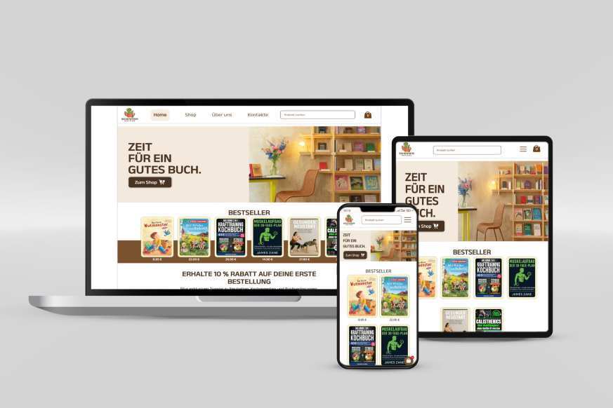

# 📚 Bookworm — React Shopping Cart Demo
[Demo](https://shopping-card2.vercel.app/)

Ein moderner, responsiver Online-Buchladen, der mit **React**, **React Router** und **Tailwind CSS** erstellt wurde.  
Dieses Projekt dient als **Portfolio-Demonstration** und zeigt die Implementierung eines vollständigen **Warenkorbs**, **Toast-Benachrichtigungen** sowie die Arbeit mit **eigenen JSON-Daten** als Datenquelle.  
Das Design wurde von mir vollständig in **Figma** entworfen → [Design ansehen](https://www.figma.com/proto/6Cyb8D4hYA32r80uxLjUu8/Shopping-Card?node-id=0-1&t=6p9ex5TMb7FIjbM5-1)

---

### 📸 Screenshots



---

## 🚀 Features

- 🛒 **Warenkorb mit localStorage-Persistenz**  
  Produkte bleiben auch nach dem Neuladen der Seite erhalten.

- 💬 **Toast-Benachrichtigungen**  
  Sofortiges Feedback beim Hinzufügen oder Entfernen von Artikeln.

- 🪟 **Modal-Fenster für Warenkorb**  
  Saubere und benutzerfreundliche Darstellung des Checkout-Bereichs.

- 🔍 **Produktsuche mit Live-Filterung**

- 🧾 **Produktdaten aus eigenem JSON**  
  Alle Bücher werden aus einer selbst erstellten JSON-Quelle (MockAPI) geladen  
  und per Fetch dynamisch im Frontend angezeigt.

- 📨 **Newsletter-Anmeldung mit E-Mail-Bestätigung**  
  Funktionierendes Formular mit echtem Versand einer Bestätigungsmail.

- 🧩 **Kategoriesystem & Pagination**  
  Filterung nach Kategorien, Pagination am Desktop, Infinite Scroll auf Mobilgeräten.

- 📱 **Responsives Design**  
  Angepasst für Desktop, Tablet und Mobile – mit schwebendem Warenkorb-Button.

- ⚖️ **Rechtliche Seiten integriert**  
  AGB, Impressum, Datenschutz, Zahlungsmethoden, Versand & Rückgabe.

---

## 🛠️ Tech-Stack

| Technologie | Verwendung |
|--------------|------------|
| **React 18** | Komponentenbasierte Architektur |
| **React Router v6** | Routing zwischen Seiten |
| **Tailwind CSS** | Styling & Responsive Layout |
| **MockAPI / JSON-File** | Eigene Datenquelle für Bücher |
| **Font Awesome** | Icons |
| **LocalStorage** | Speicherung des Warenkorbs |
| **Fetch API** | Laden externer JSON-Daten & POST-Requests |
| **Figma** | Design und UI/UX-Konzept |

---

## ⚙️ Installation & Start

```bash
# Repository klonen
git clone https://github.com/TAURUS-ESSEN/shoppingCard2

# In den Projektordner wechseln
cd bookworm

# Abhängigkeiten installieren
npm install
```
⚠️ Hinweis

Dieses Projekt ist rein zu Demonstrationszwecken erstellt.
Kein echter Verkauf, keine Speicherung realer Kundendaten.
Alle Bilder und Texte wurden teilweise mithilfe von KI generiert.
Die JSON-Daten stammen aus einer selbst erstellten API (MockAPI).

🧑‍💻 Autor
Yevhen Reitarov
📍 Essen, Deutschland

